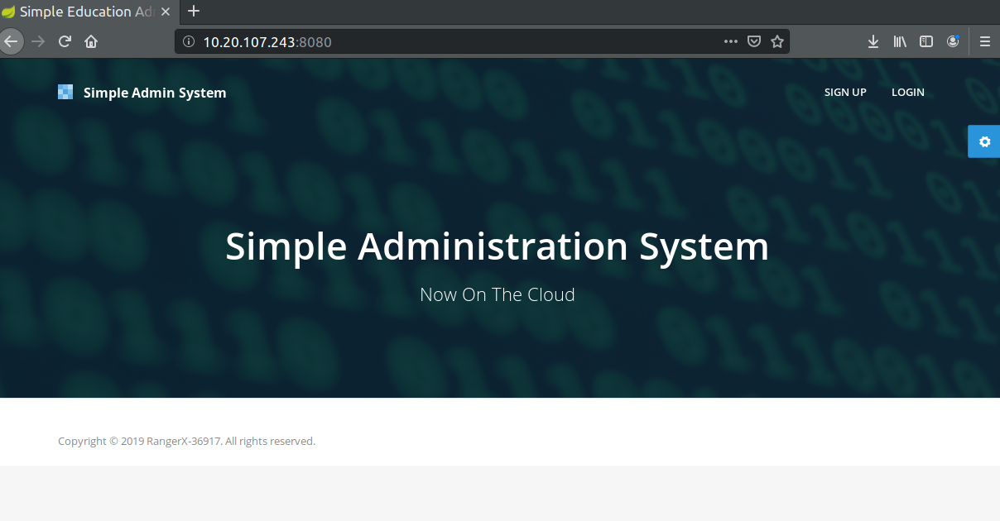
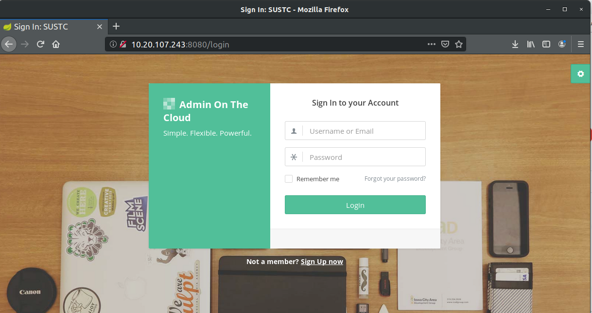
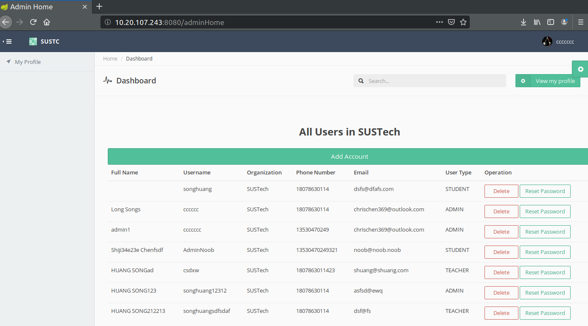
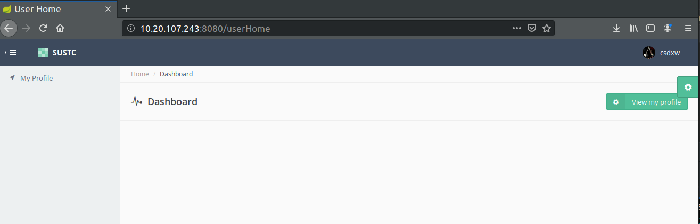
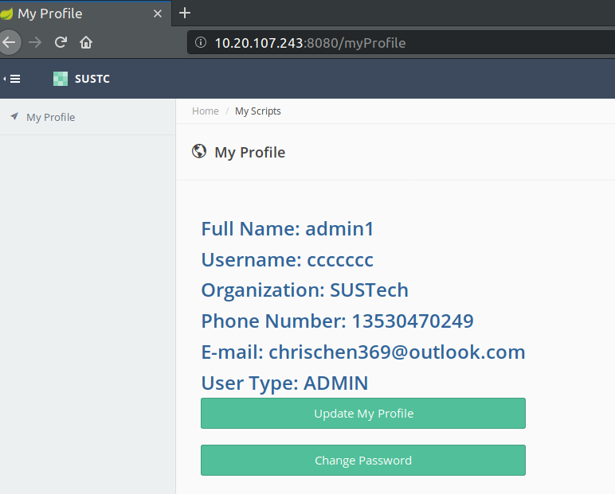
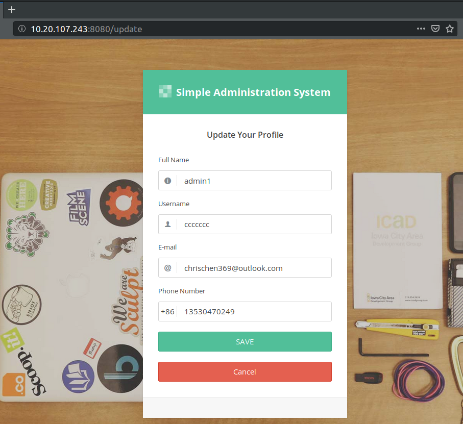
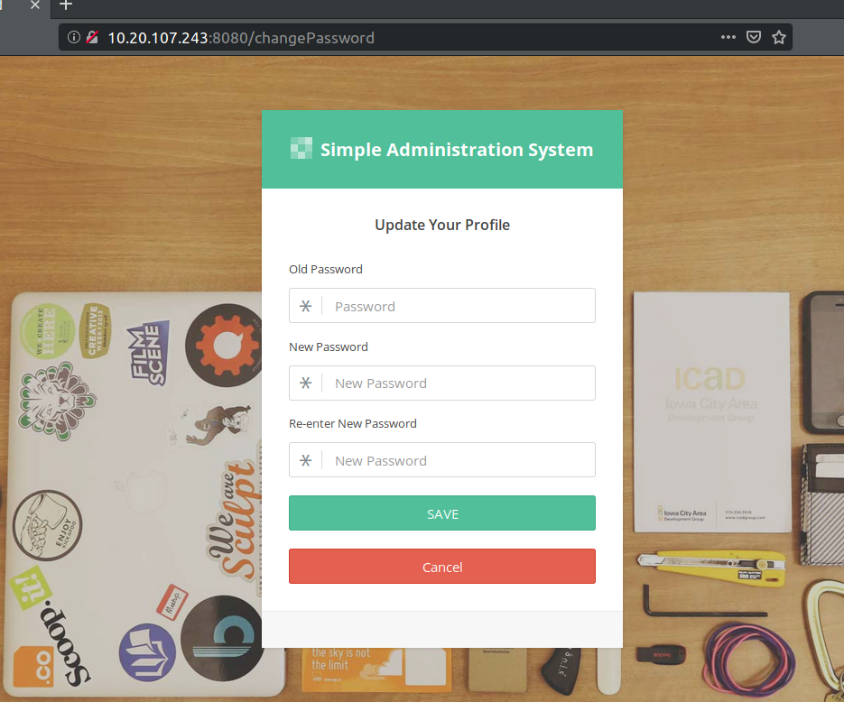

## Design
* Model Design
  * A typical Model-View-Controller architecture using Sringboot and Thymeleaf framework.
  * Admin
    * As the administrator of the system.
    * Can add, modify and delete users in his organization.
  * User (student & teacher)
    * As members of a organization.
    * In principle, their accounts can only be created by admins of their organization.
    * Can only update their own personal information.
  * I didn't implement functions for course management.
  * I preserved the Signup function so that you can play with the system freely. But you can disable it by remove the link in the home page. In principle, admin accounts are pre-configured and user accounts are added by the admin.
  * The password is encrypted before being put into the database.
  
* Class Design

     Here I list the important classes in this project. Since there is no complicated dependencies, I omit the class diagram.

  * api (interact with database)
    * UserRepository (Interface)
        
        This class makes use of JPA. So there's no needed to implement this interface myself.
  * Model (only `user` in this project)
    * User
  * Service (for data access)
    * Authentication
      * LoginService
      * PasswordAuthentication
      * SignupService
    * Userservice (Interface)
    * UserServiceImpl
  * Web (for handling web page requests)
    * MainController
    * PageController
    * UserController
    * UserProfileController
  * SimpleAdminSys (the main class)
  The html pages can be found at `/src/main/resources/templates`
## Problems
* Learn to use the Springboot and Thymeleaf framework.
* Dealing with data passing between the front-end and back-end is difficult at the beginning.
## Running Result
The app is deployed to 10.20.107.243:8080. The database is on the same machine but remote access is viable through port 3306. (I have only 1 server...)

* Home Screen
  
* Login Screen
  
* After Admin Login
  

  Admin can see all the users under its organization and can add or delete an user. Admin can also reset a user's password to "password".
* After User Login
  
  User cannot see any additional information.
* Profile Page
  
* Updating Profile
  
* Changing Password
  
